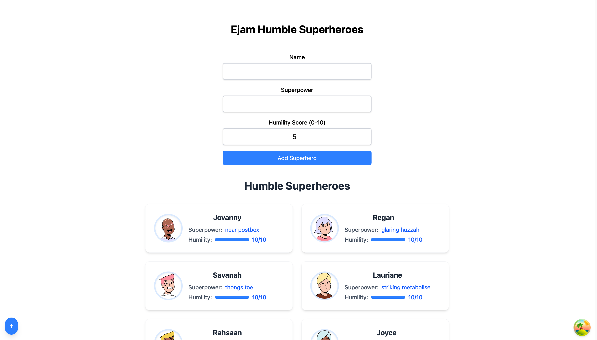

## Ejam API - Humble Superhero Frontend

### Prerequisites
- Node.js (v22.13.1) ([fnm](https://github.com/Schniz/fnm) recommended for managing node versions)
- Backend API running ([see backend README](../backend/README.md))

### Getting Started
1. Install dependencies: `fnm use && npm install`
2. Run the development server: `npm run dev`
3. Open your browser and navigate to [http://localhost:5173](http://localhost:5173)

### Notes
- The frontend is built with Vite and React.
- Uses React Query for managing async state management.
- Uses TailwindCSS for styling.

### Given more time, things I would have done
- Use a component library like MUI, or Ant Design
- Add analytics e.g. Google Analytics, or PostHog
- Write tests
- Add more error handling
- Use web sockets for real-time updates
- Allow user to upload their own superheroes images
- Add a search bar
- Add a filter for the superheroes, depending on superpower
- Add a filter for the superheroes, depending on humility score
- Add a compare feature, where you can compare two superheroes
- Add a feature where you can add a superhero to your favorites
- Add a feature where you can add a superhero to your team
- Add a feature where you can add a superhero to your enemies

